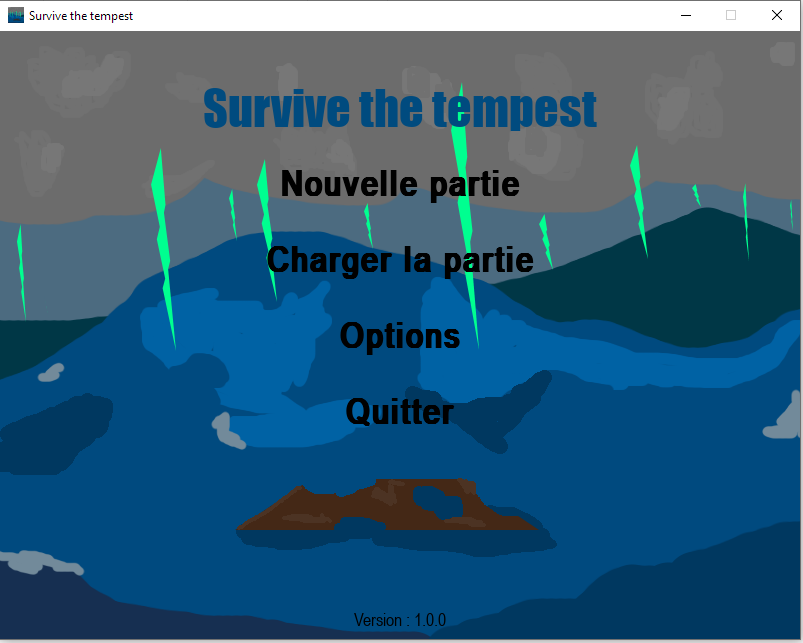
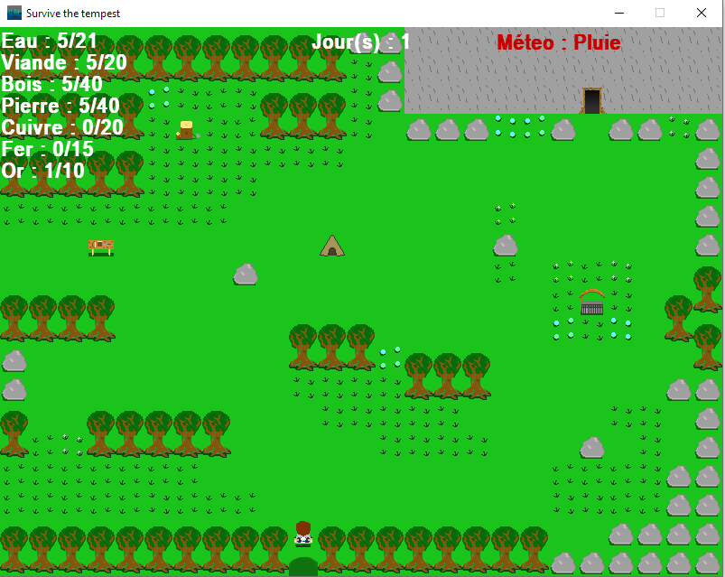

# SurvivetheTempest

**Jeu créé par Azales &amp; Jayllyz**

## C'est quoi ce jeu ?

Vous jouez un survivant météorologue qui doit survivre sur une ile déserte, grâce à vos compétences vous prévoyez une tempête dans les prochains jours, mais vous ne savez pas précisément quand !

Il va falloir vous préparer un abri afin de résister à cette fameuse tempête qui arrivera dans les prochains jours.

## Quelques détails du jeu

Chaque tour de jeu correspond à un jour.

Chaque jour le joueur dispose de 4 actions possibles :

- Couper du bois
- Récupérer de l’eau
- Aller chasser
- Récupérer de la pierre

Il va falloir choisir très rigoureusement quelle action choisir pour ne pas manquer de quoi que ce soit, car à chaque fin de jour une partie des ressources(viande, eau) diminue, si l’on est à 0 d’eau ou de viande avant la fin du jour, on meurt et la partie prend fin.

Vous allez pouvoir améliorer votre capacité à chasser, prendre de l'eau, du bois ou encore de la pierre grace aux différents batiments que vous pourrez découvrir utiliser durant une partie, pour les détails tout est écrit dans `rules.md`.

**Immmense merci à Flywase pour la musique du jeu.**

_Si vous rencontrez un problème avec les contrôles du jeu vous pouvez supprimer `controls.ctrl` situé dans `data`._

